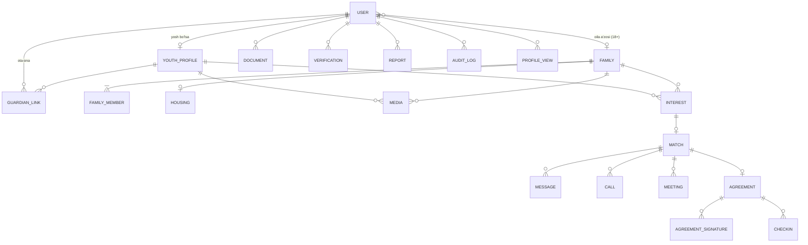

# TZ — "Ikkinchi oila" platformasi (ishchi nom: "Mehr")

> Holat: **v1.3**. Savol-javoblar asosida to'ldirib boramiz.
> Sana: 2026-10-03

---

## ✅ Qabul qilingan qarorlar (log)

| # | Qaror | Izoh |
|---|---|---|
| 1 | Egasi — **NNT / xayriya fondi** | Fond verifikatsiya, moderatsiya va uchrashuvlar uchun javobgar |
| 2 | Mehribonlik uylari **emas** | Auditoriya — boshqa viloyatdan o'qishga kelgan yoshlar |
| 3 | **Ikki tomonlama** qidiruv | Yosh oila qidiradi, oila yosh qidiradi |
| 4 | Yosh o'zi profil yaratadi | Qiziqishlar, qobiliyatlar, maqsadlar + rasm va video |
| 5 | Yosh chegarasi — **14+**, lekin bosqichma-bosqich: **MVP 18+**, 14–17 v2 da (ota-ona moduli tayyor bo'lgach) | 6-bo'limdagi 14–17 qoidalari v2 bilan birga yoqiladi. Baza sxemasi ularni boshidan qo'llab-quvvatlaydi |
| 6 | Munosabat turlari: **oilada yashash, mentorlik, moddiy homiylik** | Bitta juftlik bir nechtasini tanlashi mumkin |
| 7 | Platforma **bepul**, fond grant/xayriya hisobidan | Platforma ichida pul o'tkazmasi yo'q |
| 8 | **PWA (web + Android/iOS'ga o'rnatiladi) + Telegram bot** | Do'konlar orqali emas, sayt orqali o'rnatiladi. Native ilova — kerak bo'lsagina, keyinroq |
| 9 | Fond — **hali aniq emas** | ⚠️ Uchrashuvlar va verifikatsiya koordinatorlarga bog'liq — bu qaror ishga tushishdan oldin yopilishi shart |
| 10 | Geografiya — **butun O'zbekiston** | Har bir viloyatda kamida 1 koordinator kerak (14 ta hudud) |
| 11 | Tillar — **o'zbek (lotin), o'zbek (kirill), rus, qoraqalpoq** | i18n boshidan, lotin↔kirill avtomatik transliteratsiya |
| 12 | Jins qoidasi — **qat'iy** | 14–17 yoshli qiz faqat katta ayol a'zosi bor oilada yashaydi; yolg'iz erkak bilan yashash taqiqlanadi (barcha 14–17 uchun) |
| 13 | Oila = guruh, **har bir katta odamning o'z logini bor** | Chatda kim yozgani ko'rinadi, javobgarlik shaxsiy |
| 14 | Yosh — bir vaqtda **faqat 1 ta oila** bilan faol munosabatda bo'ladi | Bitta oila bir nechta tur taklif qilishi mumkin |
| 15 | Oila: **yashash ≤2, mentorlik/yordam ≤5** yosh bir vaqtda | Ekspluatatsiyaga qarshi |
| 16 | Backend — **NestJS** (standart tanlov) | Tasdiqlanmagan, o'zgartirish mumkin |
| 17 | Navigatsiya — **5 tab**: Bosh / Qidiruv / Qiziqishlar / Chat / Profil | + yuqorida doim 🔔 va **SOS** |
| 18 | Ko'rish formati — **kartochkalar lentasi** | To'liq ekranli "swipe" formati yo'q |
| 19 | Onboarding — **avval tez profil, hujjatlar keyin** | Verifikatsiyadan o'tmaguncha boshqalarning profillari ko'rinmaydi, o'z profili ham ko'rinmaydi |
| 20 | Xodimlar uchun **alohida desktop web panel** | admin.<domen> — VPN/IP allowlist + 2FA |
| 21 | Jamoa — **1 dasturchi + Claude**, MVP muddati **4–6 oy** | |
| 22 | MVP'dan keyinga qoldirildi: **video qo'ng'iroq, OneID** | Ovozli xabar (STT) va qoraqalpoq tili MVP'da qoladi |
| 23 | Brend — **"Mehr"** (ishchi nom) | Yakuniy nom keyinroq tanlanadi |
| 24 | Fond — **mavjud NNT bilan hamkorlik** | NNT xodimlari koordinator bo'ladi; memorandum + safeguarding siyosati kelishib olinadi |
| 25 | 14–17 yashash turida kuzatuv — **faqat oylik check-in** (v2) | Uyga tashrif faqat munosabat boshlanishidan oldin bo'ladi (6-bo'lim) |
| 26 | Kirish — **faqat Telegram orqali** (MVP): bot deep-link + "Raqamni yuborish" tugmasi | Telefon raqamini Telegram tasdiqlaydi, SMS shlyuz kerak emas. SMS OTP — kerak bo'lsa keyinroq |

---

## 1. Kontseptsiya

Boshqa viloyatdan o'qishga kelgan yosh (litsey, kollej, texnikum, OTM) — yolg'iz, ijara qimmat, shahar notanish. Platformada o'zi haqida yozadi: kim, nimaga qiziqadi, nima qila oladi, qanday oilani xohlaydi. Rasm va video qo'yadi.

Oilalar (farzandsiz, farzandlari katta bo'lib ketgan, yordam bermoqchi bo'lganlar) ham profil ochadi. Ikki tomon bir-birini moslik bo'yicha topadi → fond orqali tanishadi → "ikkinchi oila" munosabati boshlanadi.

**Tanishuv saytidan nima olamiz:** profil, so'rovnoma, moslik foizi, qiziqish bildirish, o'zaro rozilik bo'lgandagina chat ochilishi, bosqichma-bosqich tanishuv.
**Nima olmaymiz:** swipe, "yoqdi" lentasi, reyting/ballar, tashqi ko'rinish bo'yicha filtr.

> Huquqiy jihat: yoshning ota-onasi bor, shuning uchun bu yuridik ma'nodagi "asrab olish" emas. Bu **homiylik / host family / mentorlik**. Brending va matnlarda "asrab olish" so'zini ehtiyotkorlik bilan ishlatamiz.

---

## 2. Muammo (odamlarning og'riqlari)

### Yoshlar
- Ijara qimmat, yotoqxona yetmaydi yoki sifatsiz.
- Yolg'izlik, yangi shaharga moslashish qiyin, psixologik bosim.
- Kattalar maslahati yo'q (o'qish, ish, hayot).
- 14–17 yoshlilar uchun ota-onasi xavotirda: "bolam kimnikida yashaydi?"

### Oilalar
- Yordam bermoqchi, lekin kimga, qanday — bilmaydi.
- Notanish odamni uyga qo'yishdan qo'rqadi (ishonch muammosi).
- Farzandi yo'q yoki uyi bo'shab qolgan — mehr berishga ehtiyoj.

### Yoshning ota-onasi (viloyatda)
- Farzandini tanimagan odamga ishonib topshirish qo'rqinchli.
- Aloqa va nazorat qilish imkoniyati kerak.

**Xulosa:** asosiy qiymat — **ishonch**. Platforma ishonchni verifikatsiya, fond nazorati va shaffoflik orqali yaratadi.

---

## 3. Foydalanuvchi rollari

| Rol | Nima qiladi |
|---|---|
| **Yosh (14–17)** | Profil, rasm/video, oilalarni ko'radi, qiziqish bildiradi. Faqat himoya rejimida |
| **Yosh (18+)** | Xuddi shu, lekin himoya rejimi yengilroq |
| **Yoshning ota-onasi / qonuniy vakili** | 14–17 uchun majburiy: roziligini tasdiqlaydi, chatni kuzatadi, oilani tasdiqlaydi |
| **Oila** | Profil (oila a'zolari, uy, sharoit), verifikatsiya, yoshlarni ko'radi, qiziqish bildiradi |
| **Fond koordinatori** | Verifikatsiya, uchrashuvlarni tashkil qilish, juftliklarni kuzatish |
| **Moderator** | Kontent (rasm/video/matn), shikoyatlar, chat moderatsiyasi |
| **Psixolog** | Konsultatsiya, oila va yoshning tayyorgarligini baholash |
| **Admin** | Tizim, rollar, audit, analitika |
| **Mehmon** | Faqat platforma haqida ma'lumot, hikoyalar, statistika. **Profillarni ko'rmaydi** |

---

## 4. Asosiy oqim

```
1. Ro'yxat (telefon + Telegram / OneID)
2. Verifikatsiya
   - Yosh: pasport/ID karta + o'qish joyidan ma'lumotnoma; 14–17 → ota-ona roziligi (video yoki notarial)
   - Oila: barcha kattalar uchun pasport + sudlanmaganlik ma'lumotnomasi + uy manzili + fond koordinatori bilan intervyu
3. Profil + so'rovnoma (qiziqishlar, qadriyatlar, kun tartibi, munosabat turi)
4. Moderatsiya (rasm/video/matn tekshiruvi) → profil faollashadi
5. Moslik ro'yxati (ikki tomonga ham)
6. Qiziqish bildirish → ikkinchi tomon rozi bo'lsa → "Juftlik" (match)
7. Moderatsiya qilinadigan chat (14–17 uchun ota-ona ham ko'radi)
8. Birinchi uchrashuv — fond ofisida yoki koordinator ishtirokida
9. Sinov davri (masalan, 1 oy — dam olish kunlari mehmonga borish)
10. Kelishuv (munosabat turi, qoidalar, muddat) — fond orqali imzolanadi
11. Kuzatuv: oylik check-in, yoshdan anonim so'rovnoma, "SOS" tugmasi
12. Yakunlash yoki uzaytirish (o'qish tugaguncha)
```

---

## 5. Modullar (MVP)

1. **Auth** — telefon OTP, Telegram login, keyinchalik OneID.
2. **Verifikatsiya** — hujjat yuklash, koordinator tekshiruvi, statuslar (kutilmoqda / tasdiqlangan / rad etilgan).
3. **Yosh profili** — bio, qiziqishlar, ko'nikmalar, o'qish joyi (shahar darajasida), rasm (max N), video-tanishtiruv (max 60 s).
4. **Oila profili** — a'zolar, uy sharoiti (rasmlar), qanday yordam bera oladi, qadriyatlar.
5. **Moslik algoritmi** — shahar/tuman, munosabat turi, qiziqishlar, qadriyatlar, til, jins bo'yicha afzallik (masalan, qizlar uchun ayolli oila), oila tarkibi.
6. **Qiziqish va juftlik** — o'zaro rozilik bo'lmaguncha chat yo'q.
7. **Chat** — matn + fayl, moderatsiya, avtomatik filtrlar (telefon raqami, manzil, tashqi havolalar, xavfli so'zlar).
8. **Uchrashuvlar** — koordinator taqvimi, bron, uchrashuvdan keyin ikki tomondan fikr.
9. **Kelishuv va kuzatuv** — elektron kelishuv, oylik check-in, hisobotlar.
10. **Shikoyat / SOS** — har bir ekranda, 24/7 koordinatorga va kerak bo'lsa ota-onaga xabar.
11. **Telegram bot** — bildirishnomalar, tezkor javoblar, check-in so'rovnomasi, SOS.
12. **Admin panel** — verifikatsiya navbati, moderatsiya navbati, juftliklar, shikoyatlar, analitika, audit log.
13. **Kontent bo'limi** — hikoyalar (rozilik bilan), qo'llanmalar, FAQ, fondga xayriya qilish sahifasi.

---

## 5A. Yosh profili (maydonlar)

Ko'rinish darajalari: **O** — verifikatsiyadan o'tgan oilalarga ochiq · **J** — faqat juftlikdan (match) keyin · **Y** — faqat fond/moderator ko'radi

### Asosiy ma'lumotlar
| Maydon | Turi | Majburiy | Ko'rinish | Izoh |
|---|---|---|---|---|
| Ism | matn | ✅ | O | |
| Familiya | matn | ✅ | O: bosh harfi, J: to'liq | "Aziz K." |
| Tug'ilgan sana | sana | ✅ | O: faqat yosh, Y: sana | 14+ tekshiruvi shu maydon bo'yicha |
| Jins | enum | ✅ | O | Jins qoidasi (#12) uchun |
| Qayerdan kelgan | viloyat | ✅ | O | Tuman/qishloq yo'q |
| Hozir yashaydigan shahar | shahar | ✅ | O | Moslik uchun |
| O'qish joyi turi | enum: litsey/kollej/texnikum/OTM | ✅ | O | |
| Yo'nalish / kurs | matn | ✅ | O | |
| O'qish joyining nomi | matn | ✅ | J | |
| Telefon, hujjatlar | — | ✅ | Y | Hech qachon oilaga ko'rinmaydi |

### O'zi haqida
| Maydon | Turi | Majburiy | Izoh |
|---|---|---|---|
| Qiziqishlar | teglar (tayyor ro'yxat + o'zi qo'shadi) | ✅ min 3 | Yangi teg moderatsiyadan o'tadi |
| Ko'nikmalar | teglar | ✅ min 2 | Uy ishlari, repetitorlik, IT, ta'mirlash... |
| Maqsadlar va orzular | erkin matn, 100–1000 belgi | ✅ | Avtomatik filtr: telefon, username, havola |
| Xarakter | shkalalar: tinch↔faol, introvert↔ekstravert | ✅ | |
| Kun tartibi | erta turadi / kech yotadi, uyda ko'p/kam bo'ladi | ✅ | Birga yashash uchun |
| Odatlar | chekadimi (ha/yo'q) | ✅ | |

### Qanday oilani qidiradi
| Maydon | Turi | Izoh |
|---|---|---|
| Munosabat turi | multi: yashash / mentorlik / moddiy yordam | Asosiy filtr |
| Oila tarkibi | multi: bolali / bolasiz / keksa juftlik / yolg'iz ona / farqi yo'q | |
| Uy hayvonlari | ha / yo'q / allergiya bor | Allergiya — qat'iy filtr |
| Chekish uyda | qarshi / farqi yo'q | |
| Uydagi til | multi: o'zbek / rus / qoraqalpoq / tojik / boshqa | |
| Diniy amaliyot | muhim emas / o'xshash bo'lsin + daraja | Ixtiyoriy maydon |

### Media
- **3–6 rasm** — kamida 1 tasida yuz aniq ko'rinadi.
- **1 ta video, ≤60 s** — o'zini tanishtiradi.
- Hammasi moderatsiyadan o'tadi; EXIF o'chiriladi; qayta kodlanadi; ko'ruvchi ID si bilan watermark qo'yiladi; yuklab olish yo'q.
- Rad etish sabablari: joylashuvni ko'rsatadigan narsalar (uy, maktab formasi, ko'cha nomi), ochiq-sochiq kiyim, boshqa odamlar (ayniqsa bolalar) rozilik berilmagan holda, kontakt ma'lumotlari.

---

## 5B. Oila profili (maydonlar)

Ko'rinish darajalari 5A dagi bilan bir xil (**O / J / Y**). Oila profili faqat verifikatsiyadan o'tgan yoshlarga ko'rinadi.

### Oila a'zolari (har biri alohida yozuv)
| Maydon | Turi | Majburiy | Ko'rinish | Izoh |
|---|---|---|---|---|
| Ism | matn | ✅ | O | |
| Familiya | matn | ✅ | O: bosh harfi, J: to'liq | |
| Yosh | raqam (sanadan) | ✅ | O | |
| Jins | enum | ✅ | O | Jins qoidasi (#12) shu maydonlar asosida avtomatik tekshiriladi |
| Oiladagi roli | enum: ota / ona / farzand / buvi / bobo / boshqa qarindosh | ✅ | O | |
| Kasb / mashg'ulot | matn | 18+ uchun ✅ | O | Mentorlik uchun |
| Pasport + sudlanmaganlik ma'lumotnomasi | hujjat | 18+ uchun ✅ | Y | Uyda yashaydigan **har bir** katta odam uchun |

### Media
- Oila rasmlari: 3–6 ta, kamida 1 tasi umumiy oila rasmi.
- 1 ta video ≤60 s — oila o'zini tanishtiradi.
- Moderatsiya qoidalari 5A bilan bir xil. Oiladagi voyaga yetmagan farzandlarning yuzi faqat ota-onasining roziligi bilan ko'rsatiladi.

### Uy-sharoit (faqat "oilada yashash" taklif qilinsa)
| Maydon | Turi | Majburiy | Ko'rinish | Izoh |
|---|---|---|---|---|
| Uy turi | enum: hovli / kvartira | ✅ | O | |
| Shahar + tuman | manzil | ✅ | O | |
| Aniq manzil | manzil | ✅ | Y | Koordinator uyga tashrif buyuradi |
| Alohida xona | ha / yo'q | ✅ | O | **14–17 uchun alohida xona majburiy shart** |
| Xona rasmlari | 2–4 rasm | ✅ | O | Ko'chani yoki uyning tashqi ko'rinishini ko'rsatmaslik kerak |

### Oila nimani taklif qiladi
| Maydon | Turi | Izoh |
|---|---|---|
| Munosabat turlari | multi: yashash / mentorlik / moddiy yordam | Asosiy filtr |
| Moddiy yordam turi | multi: kontrakt, ijara, ovqat, kiyim, kurslar, transport | **Summa ko'rsatilmaydi** — savdo xavfini kamaytirish uchun |
| Mentorlik sohalari | teglar: kasbga yo'naltirish, til, IT, biznes, sport, hunar... | |
| Uy qoidalari | tuzilgan ro'yxat + erkin matn: qaytish vaqti, mehmonlar, uy ishlari, telefon/namoz/ovqat vaqtlari | Kelishuvga avtomatik kiritiladi |

### Oila qanday yoshni qidiradi
| Maydon | Turi | Izoh |
|---|---|---|
| Yosh oralig'i | min–max (14–30) | |
| Jins | qiz / yigit / farqi yo'q | #12 qoidasi bilan cheklanadi: tizim mos kelmaydigan variantni tanlatmaydi |
| Qiziqishlar va yo'nalish | teglar | Moslikda og'irlik sifatida |
| Qaysi viloyatdan | multi viloyat / farqi yo'q | **Yumshoq afzallik**: ro'yxatni tartiblaydi, lekin yoshlarni yashirmaydi |
| Uydagi til | multi | |
| Diniy amaliyot | muhim emas / o'xshash bo'lsin + daraja | Ixtiyoriy maydon |

---

## 5C. Moslik algoritmi

### 1-bosqich: qat'iy filtrlar (mos kelmasa, profil umuman ko'rsatilmaydi)
1. **Ikki tomon ham verifikatsiyadan o'tgan** va faol bo'lishi kerak.
2. **Munosabat turi** — kamida bitta tur ikkala tomonda ham bo'lishi kerak.
3. **Shahar** — "yashash" yoki "mentorlik" bo'lsa, bitta shahar bo'lishi shart. Faqat "moddiy yordam" bo'lsa, bu filtr qo'llanmaydi.
4. **Yosh oralig'i** — yosh oila ko'rsatgan oraliqqa tushishi kerak.
5. **Xavfsizlik qoidalari (14–17, yashash):** jins qoidasi (#12) va alohida xona.
6. **Allergiya / chekish** — yoshda allergiya bo'lsa, uy hayvoni bor oila chiqmaydi; yosh "chekishga qarshi" bo'lsa, uyida chekadigan oila chiqmaydi.
7. **Qora ro'yxat / avval rad etilgan / bloklangan** juftliklar chiqarib tashlanadi.

### 2-bosqich: ball (0–100)
| Mezon | Og'irlik | Hisoblash |
|---|---|---|
| Qiziqishlar + mentorlik sohasi ↔ yo'nalish | **35** | Teglar kesishmasi (Jaccard) + oilaning mentorlik sohasi yoshning yo'nalishiga mos kelsa bonus |
| Xarakter + kun tartibi | 20 | Shkalalar orasidagi masofa. Faqat "yashash" turida to'liq hisoblanadi, boshqa turlarda og'irligi yarmiga tushadi |
| Til + diniy amaliyot | 15 | Til kesishmasi + daraja farqi. Maydon "muhim emas" bo'lsa, neytral |
| Oila tarkibi ↔ yoshning istagi | 10 | |
| Viloyat afzalligi (yumshoq) | 10 | Oila istagan viloyat bo'lsa — to'liq ball, bo'lmasa — 0 (yashirilmaydi) |
| Munosabat turlarining kesishmasi | 10 | Qancha ko'p umumiy tur bo'lsa, shuncha yuqori |

- Og'irliklar admin panelda sozlanadi (konfiguratsiya, kodda emas).
- **Yangi profilga bonus** (birinchi 14 kun) — yangi kelganlar ham ko'rinishi uchun.
- **Kam ko'rilganlarga bonus** — mashhur profillar hammaning ro'yxatini egallab olmasligi uchun.

### Ko'rinish
- Kartochkada **foiz + 2–3 ta sabab** ko'rsatiladi: "87% — umumiy qiziqishlar: IT, futbol; ikkalangiz ham erta turasiz".
- Tashqi ko'rinish yoki rasm bo'yicha tartiblash/filtr **yo'q**.

### Qiziqish limitlari
| Kim | Kunlik limit | Bir vaqtda jami ochiq qiziqishlar |
|---|---|---|
| Oila | 3 | 5 |
| Yosh | 5 | 10 |

- Javobsiz qiziqish 14 kundan keyin avtomatik yopiladi va limitni bo'shatadi.
- Limit tez-tez to'ldirilsa yoki tanlovlarda g'alati naqsh bo'lsa (6-bo'limdagi anomaliya signallari) → koordinatorga signal yuboriladi.

---

## 5D. Juftlikdan keyingi jarayon

```
Juftlik (match) → Chat → [ixtiyoriy] Video qo'ng'iroq → 1-uchrashuv (koordinator bilan)
  → Sinov davri 2–4 hafta → Ikki tomonning "davom etamiz" tasdig'i
  → Kelishuv (elektron + fond tasdig'i) → Faol munosabat → Oylik check-in
  → Yakunlash (istalgan tomon) → Yakunlovchi so'rovnoma
```

### Holatlar (state machine)
`interest_sent → matched → chatting → meeting_scheduled → met → trial → trial_confirmed → agreement_pending → active → ended`
Har qanday holatdan → `frozen` (shikoyat yoki SOS) yoki `cancelled` (tomonlardan biri chiqib ketdi). Har bir o'tish audit logga yoziladi.

### Chat
| Funksiya | Qoida |
|---|---|
| Matn | Avtomatik filtr: telefon raqami, @username, havola, manzil, xavfli so'zlar → xabar ushlanadi va moderatorga yuboriladi |
| Rasm | Moderatsiya navbati, EXIF o'chiriladi, watermark |
| Ovozli xabar | ≤2 daqiqa, speech-to-text orqali matn filtridan o'tadi, matni saqlanadi |
| Video qo'ng'iroq | Platforma ichida (WebRTC). **14–17: ota-ona yoki koordinator ulanmasa, qo'ng'iroq boshlanmaydi.** Yozib olinmaydi, lekin metama'lumot (kim, qachon, qancha davom etdi) log qilinadi |
| Vaqt | Cheklovsiz (24/7). Lekin 14–17 bilan 23:00–06:00 oralig'idagi faollik anomaliya signali sifatida hisoblanadi (6-bo'lim) |
| Ota-ona ko'rinishi | 14–17: ota-ona butun chatni ko'radi |
| Saqlash | Chat tarixi o'chirilmaydi (tomonlar uchun yashirilishi mumkin, lekin fondda shikoyatlar uchun N oy saqlanadi) |

### Birinchi uchrashuv
- Joy: **fond ofisi yoki hamkor joy** (kutubxona, yoshlar markazi, kafe) — ro'yxatini admin yuritadi.
- Koordinator ishtirok etadi. 14–17 uchun ota-ona video orqali ulanishi mumkin.
- Koordinator taqvimidan bron qilinadi, 24 soat va 1 soat oldin Telegram eslatma yuboriladi.
- Uchrashuvdan keyin ikki tomon va koordinator qisqa forma to'ldiradi (yosh va oila bir-birining javobini ko'rmaydi).

### Sinov davri (2–4 hafta)
- Kamida **3 ta uchrashuv**; "yashash" turi uchun **1 ta dam olish kunini mehmonda o'tkazish** majburiy.
- Sinov davridagi uchrashuvlar platformada qayd qilinadi.
- Oxirida ikki tomon alohida tugma bosadi: "Davom etamiz" / "To'xtatamiz" (sababi faqat fondga ko'rinadi).

### Kelishuv
- Shablon munosabat turiga qarab avtomatik yig'iladi: munosabat turi, oilaning uy qoidalari, moddiy yordam turi, muddat (o'qish tugaguncha), tomonlarning majburiyatlari, chiqib ketish tartibi, fond kontaktlari va SOS.
- Imzolash: oila kattalari + yosh **SMS-kod** bilan imzolaydi; 14–17 uchun **ota-ona ham** imzolaydi → **koordinator ofisda tasdiqlaydi** → holat `active` bo'ladi.
- PDF shaklida saqlanadi, barcha tomonlarga yuboriladi.

### Kuzatuv
- **Oylik check-in Telegram bot orqali**: yosh va oila alohida, 5–7 ta savol. Yoshning javobini oila ko'rmaydi.
- Javob 3 kun ichida kelmasa → eslatma; 7 kun ichida kelmasa → koordinatorga signal yuboriladi.
- Salbiy javob yoki xavf so'zlari bo'lsa → koordinatorga darhol signal.
- SOS tugmasi doim ochiq (web + bot).

### Yakunlash
- **Istalgan tomon istalgan vaqtda** munosabatni tugata oladi.
- Yosh chiqib ketsa va boradigan joyi bo'lmasa → koordinatorga darhol signal (vaqtinchalik joy masalasi fond tomonidan hal qilinadi).
- **Yakunlovchi so'rovnoma** — ikki tomondan, faqat fondga ko'rinadi.

### Muvaffaqiyat belgisi
- Kelishuvi `active` holatida 3+ oy davom etgan va yakunlovchi so'rovnomasi ijobiy bo'lgan juftliklar uchun **profilda "muvaffaqiyat" belgisi** qo'yiladi: oila profilida "N ta muvaffaqiyatli juftlik", yosh profilida esa faqat o'zi rozi bo'lsa.
- Belgi faqat verifikatsiyadan o'tgan foydalanuvchilarga ko'rinadi (mehmonlar profillarni ko'rmaydi — #3-rol qoidasi).
- Bosh sahifada esa faqat anonim statistika ko'rsatiladi.

---

## 5E. Ma'lumotlar modeli (ER)



### Jadvallar

**Foydalanuvchilar va rollar**
| Jadval | Asosiy maydonlar |
|---|---|
| `users` | id, phone (unique), telegram_id, oneid_id, role (youth / family_adult / guardian / coordinator / moderator / psychologist / admin), locale (uz_latn / uz_cyrl / ru / kaa), status (pending / active / frozen / banned / deleted), birth_date, gender, region_id, created_at |
| `sessions` | id, user_id, device, ip, created_at, revoked_at |
| `staff_regions` | user_id, region_id — koordinator qaysi viloyatga javobgar |

**Profillar**
| Jadval | Asosiy maydonlar |
|---|---|
| `youth_profiles` | user_id, first_name, last_name, home_region_id, city_id, school_type, school_name, field_of_study, course, bio_goals, temperament (json shkalalar), routine (json), smokes, prefs (json: munosabat turlari, oila tarkibi, uy hayvoni/allergiya, chekish, til, din), is_minor (hisoblanadi), visibility_status |
| `guardian_links` | youth_user_id, guardian_user_id, relation, consent_status, consent_doc_id, consented_at |
| `families` | id, city_id, district_id, offer_types[], support_types[], mentor_areas[], house_rules (json), prefs (json: yosh oralig'i, jins, viloyatlar, til, din), active_living_count, active_other_count, success_count |
| `family_members` | id, family_id, user_id (18+ bo'lsa), first_name, last_name, birth_date, gender, role_in_family, occupation, lives_in_house |
| `housing` | family_id, type (hovli/kvartira), exact_address (🔒 shifrlangan), has_private_room, pets, smoking_inside, inspected_at, inspected_by |
| `tags` / `profile_tags` | Qiziqishlar, ko'nikmalar, mentorlik sohalari; teg tasdiqlanganmi (moderatsiya) |

**Verifikatsiya va hujjatlar**
| Jadval | Asosiy maydonlar |
|---|---|
| `documents` | id, owner_user_id, type (passport / criminal_record / study_cert / consent / agreement), storage_key (🔒), sha256, status, expires_at |
| `verifications` | id, subject_user_id / family_id, type, status, reviewer_id, reason, created_at, decided_at |
| `blacklist` | passport_hash, reason, added_by, created_at |

**Media**
| Jadval | Asosiy maydonlar |
|---|---|
| `media` | id, owner (youth/family), kind (photo/video/voice), original_key (🔒), processed_key, hls_key, duration, moderation_status, reject_reason, order |

**Moslik va juftlik**
| Jadval | Asosiy maydonlar |
|---|---|
| `match_scores` | youth_id, family_id, score, reasons (json), computed_at — kesh, fonda qayta hisoblanadi |
| `interests` | id, from_side, youth_id, family_id, status (sent / accepted / declined / expired), created_at |
| `matches` | id, youth_id, family_id, state (5D bo'limidagi state machine), offer_types[], created_at |
| `match_state_history` | match_id, from_state, to_state, actor_id, reason, at |

**Muloqot**
| Jadval | Asosiy maydonlar |
|---|---|
| `messages` | id, match_id, sender_id, kind (text/photo/voice), body, media_id, transcript, filter_flags (json), moderation_status, created_at, hidden_for[] |
| `calls` | id, match_id, started_by, participants[], supervisor_id (14–17 uchun shart), started_at, ended_at |
| `meetings` | id, match_id, venue_id, coordinator_id, scheduled_at, status, feedback (json — har bir tomondan alohida) |
| `venues` | id, city_id, name, address, type (fond ofisi / hamkor joy) |

**Kelishuv va kuzatuv**
| Jadval | Asosiy maydonlar |
|---|---|
| `agreements` | id, match_id, template_version, content (json), pdf_key, status, approved_by, approved_at, ends_at |
| `agreement_signatures` | agreement_id, user_id, sms_code_hash, ip, signed_at |
| `checkins` | id, agreement_id, respondent_id, answers (json), risk_flag, due_at, answered_at |
| `exit_surveys` | match_id, respondent_id, answers (json) |

**Xavfsizlik va audit**
| Jadval | Asosiy maydonlar |
|---|---|
| `reports` | id, reporter_id, target_user_id / message_id / media_id, category, is_sos, status, assignee_id, resolution |
| `risk_signals` | id, subject_id, type (night_activity / off_platform / mass_interest / gift_money / ...), score, details, reviewed_by |
| `profile_views` | viewer_id, profile_id, viewed_at — faqat qo'shiladi, o'zgartirilmaydi |
| `audit_log` | actor_id, action, entity, entity_id, diff (json), ip, at — faqat qo'shiladi (append-only) |

**Ma'lumotnomalar va kontent**
`regions`, `cities`, `districts`, `stories` (hikoyalar, roziliklar bilan), `notifications`, `settings` (moslik og'irliklari, limitlar).

### Bazaning darajasida ishlaydigan biznes-qoidalar
- Yoshda `matches.state = active` bo'lgan yozuv bir vaqtda faqat **1 ta** bo'ladi (partial unique index).
- Oilada faol munosabatlar: yashash **≤2**, boshqa turlar **≤5** (tranzaksiya ichida tekshiriladi).
- Yosh 14–17 bo'lsa: `guardian_links.consent_status = approved` bo'lmasa, profil `active` holatiga o'tmaydi.
- 14–17 + yashash bo'lsa: jins qoidasi va `housing.has_private_room = true` sharti `interest` yaratilayotganda ham, `agreement` tasdiqlanayotganda ham tekshiriladi.
- 🔒 belgili maydonlar ilova darajasida shifrlanadi (KMS kalitlari bilan).

---

## 5F. Ekranlar

### Umumiy karkas (PWA)
```
┌──────────────────────────┐
│  Mehr            🔔  SOS │  ← SOS har bir ekranda
├──────────────────────────┤
│        (kontent)         │
├──────────────────────────┤
│ 🏠   🔍   💛   💬   👤   │  ← Bosh / Qidiruv / Qiziqishlar / Chat / Profil
└──────────────────────────┘
```

### A. Ochiq qism (mehmon)
| # | Ekran | Tarkibi |
|---|---|---|
| A1 | Landing | Platforma nima, qanday ishlaydi (3 qadam), xavfsizlik va'dalari, anonim statistika, "Yosh" / "Oila" tugmalari |
| A2 | Qanday ishlaydi | Yoshlar, oilalar va ota-onalar uchun alohida bo'limlar |
| A3 | Xavfsizlik | Verifikatsiya, safeguarding, SOS — ota-onalarni ishontirish uchun |
| A4 | Hikoyalar | Rozilik bilan berilgan hikoyalar |
| A5 | FAQ, Kontaktlar, Fondga xayriya | |
| A6 | PWA o'rnatish ko'rsatmasi | Android: tugma; iOS: "Ulashish → Bosh ekranga qo'shish" rasmli ko'rsatmasi |
| A7 | Til tanlash | uz-lotin / uz-kirill / ru / qoraqalpoq |

### B. Ro'yxatdan o'tish va onboarding (tez profil → hujjatlar)
| # | Ekran | Izoh |
|---|---|---|
| B1 | Telefon + OTP / Telegram login | |
| B2 | Rol tanlash | Yosh / Oila / Ota-ona (taklif havolasi orqali) |
| B3 | Tez profil | Yosh: ism, tug'ilgan sana, jins, viloyat, shahar, o'qish joyi. Oila: shahar, a'zolar soni, taklif turlari |
| B4 | Batafsil so'rovnoma | Qiziqishlar, xarakter, kun tartibi, afzalliklar — bosqichma-bosqich, progress bar bilan |
| B5 | Media yuklash | Rasmlar + video, qoidalari ko'rsatilgan, kesish va siqish |
| B6 | Hujjatlar | Pasport, ma'lumotnomalar; oila uchun har bir katta a'zo alohida |
| B7 | Ota-onani taklif qilish (14–17) | Ota-onaning telefon raqami → SMS havola |
| B8 | Kutish holati | "Profilingiz tekshirilmoqda" + checklist: nima tayyor, nima yetishmaydi |

> Tasdiqlanmaguncha: Qidiruv va Bosh tablari **qulflangan** bo'ladi (ichida "Verifikatsiyani yakunlang" xabari ko'rinadi), faqat Profil tabi ishlaydi.

### C. Yosh ilovasi
| Tab | Ekranlar |
|---|---|
| 🏠 Bosh | Tavsiya etilgan oilalar lentasi (foiz + sabablar), faol munosabat kartochkasi (agar bo'lsa), keyingi uchrashuv, check-in eslatmasi |
| 🔍 Qidiruv | Filtrlar (munosabat turi, oila tarkibi, til...) + lenta → **Oila profili**: rasmlar, video, a'zolar, uy/xona, taklif, uy qoidalari, moslik sabablari, "Qiziqish bildirish", "Shikoyat" |
| 💛 Qiziqishlar | 3 ta tab: Kiruvchi / Yuborilgan / Juftliklar; limit ko'rsatkichi (masalan, "bugun 3/5") |
| 💬 Chat | Juftliklar ro'yxati → chat (matn, rasm, ovoz, video qo'ng'iroq), 14–17 uchun "👁 Ota-onangiz ham ko'radi" banneri, uchrashuv bron qilish tugmasi |
| 👤 Profil | Profilni ko'rish/tahrirlash, media, hujjatlar holati, sozlamalar (til, bildirishnomalar, Telegram ulash), maxfiylik, akkauntni o'chirish |

Qo'shimcha ekranlar:
- **Juftlik sahifasi:** holatlar zanjiri (stepper), uchrashuvlar, sinov davri checklisti, "Davom etamiz / To'xtatamiz".
- **Kelishuv:** o'qish → SMS-kod bilan imzolash → PDF.
- **Check-in:** web'da yoki botda.
- **SOS:** tez tugmalar ("Xavf ostidaman", "Ketmoqchiman", "Gaplashmoqchiman") + 112 / ishonch telefoni.

### D. Oila ilovasi
C bilan bir xil karkas, lekin farqlari:
- 🏠 / 🔍 — yoshlar lentasi; yosh profili: rasmlar, video, qiziqishlar, maqsadlar, xarakter, o'qish joyi turi.
- 👤 Profil — **Oila a'zolari** boshqaruvi (a'zoni taklif qilish, har birining hujjatlari), **Uy-sharoit**, **Taklif va uy qoidalari**, limitlar (yashash 1/2, boshqa 3/5).
- Chatda har bir xabarda qaysi a'zo yozgani ko'rinadi.

### E. Ota-ona ilovasi (14–17)
| # | Ekran |
|---|---|
| E1 | Taklifni qabul qilish → verifikatsiya → rozilik (video yoki hujjat) |
| E2 | Farzandim: profili, holati, juftliklari |
| E3 | Chatlarni o'qish (faqat o'qish uchun) + video qo'ng'iroqqa ulanish |
| E4 | Oila profilini tasdiqlash / rad etish (yashash turi uchun) |
| E5 | Kelishuvni imzolash |
| E6 | Bildirishnomalar + koordinator bilan aloqa + SOS |

### F. Xodimlar paneli (desktop, alohida domen)
| Bo'lim | Ekranlar | Kim ishlatadi |
|---|---|---|
| Dashboard | Navbatlar soni, signallar, SOS, viloyat bo'yicha xarita | Hammasi |
| Verifikatsiya navbati | Hujjatni ko'rish (yonma-yon), tasdiqlash/rad etish + sabab, qora ro'yxat bo'yicha tekshiruv | Koordinator |
| Moderatsiya navbati | Rasm / video / matn / teglar, ushlangan chat xabarlari | Moderator |
| Foydalanuvchilar | Qidiruv, karta: profil, hujjatlar, juftliklar, ko'rishlar logi, signallar; muzlatish/ban | Koordinator, admin |
| Juftliklar | Ro'yxat + holati, holatlar tarixi, chatni ko'rish (asosli sabab bilan, log qilinadi) | Koordinator |
| Uchrashuvlar | Koordinator taqvimi, joylar (venues), feedback | Koordinator |
| Uyga tashriflar | Reja, natija, rasmlar | Koordinator |
| Kelishuvlar | Tasdiqlash navbati, shablonlar va versiyalar | Koordinator, admin |
| Check-in | Javob bermaganlar, xavf belgisi qo'yilganlar | Koordinator, psixolog |
| Shikoyatlar / SOS | Navbat, tayinlash, SLA taymeri, harakatlar playbooki | Koordinator |
| Xavf signallari | Anomaliyalar, ballar, ko'rib chiqish | Moderator, admin |
| Kontent | Hikoyalar, FAQ, teglar | Admin |
| Sozlamalar | Moslik og'irliklari, limitlar, viloyatlar, xodimlar va rollar | Admin |
| Audit | Kim nimani ko'rdi/o'zgartirdi | Admin |
| Analitika | Voronka, juftliklar, muvaffaqiyat, viloyatlar | Admin |

### G. Telegram bot
`/start` (akkaunt ulash) · bildirishnomalar (yangi qiziqish, xabar, uchrashuv) · oylik check-in · SOS · "Ilovani ochish" tugmasi.

---

## 5G. API spetsifikatsiya (v1)

### Umumiy qoidalar
- Asos: `https://api.<domen>/v1` · REST + JSON · real-time uchun WebSocket `/ws`
- Auth: qisqa muddatli **access JWT (15 daqiqa)** + **refresh token** (httpOnly cookie, rotatsiya qilinadi, qayta ishlatilsa — barcha sessiyalar bekor qilinadi)
- Admin API alohida: `https://admin-api.<domen>/v1` — VPN/IP allowlist + majburiy TOTP 2FA
- Tilni tanlash: `Accept-Language: uz-Latn | uz-Cyrl | ru | kaa`
- Sahifalash: kursor bilan, `?cursor=&limit=` (max 50)
- Xatolar: `{ "error": { "code": "LIMIT_REACHED", "message": "...", "details": {} } }`
- Idempotentlik: `POST` so'rovlarida `Idempotency-Key` sarlavhasi (qiziqish, imzo, SOS uchun)
- Rate limit: IP + user bo'yicha; OTP — 3 urinish / 10 daqiqa
- Avtorizatsiya: RBAC + **obyekt darajasida tekshiruv** (IDOR'ga qarshi — har bir `:id` uchun egalik yoki rol tekshiriladi). Bitta markaziy policy qatlami, har bir endpointga test yoziladi
- Fayllar: **presigned URL** orqali yuklanadi → `confirm` → qayta ishlash navbatiga tushadi. Ko'rish — qisqa muddatli (60 s) imzolangan URL + watermark

### Auth
| Metod | Yo'l | Izoh |
|---|---|---|
| POST | `/auth/telegram/start` | → `{loginId, pollToken, deepLink}` — deep-link `t.me/<bot>?start=login_<kod>` |
| POST | `/auth/telegram/poll` | `{loginId, pollToken}` → `PENDING` / `EXPIRED` / `OK` + tokenlar (bir martalik) |
| POST | `/internal/telegram/login-confirm` | Faqat bot (X-Internal-Secret): `{code, telegramId, phone?}` → `OK` / `NEED_PHONE` / `PHONE_TAKEN` / ... |
| POST | `/auth/refresh` | |
| POST | `/auth/logout` | |
| GET | `/auth/sessions` · DELETE `/auth/sessions/:id` | Qurilmalar ro'yxati |

### Men / onboarding
| Metod | Yo'l | Izoh |
|---|---|---|
| GET | `/me` | Rol, holat, onboarding checklisti |
| PATCH | `/me` | Til, bildirishnoma sozlamalari |
| POST | `/me/role` | `youth` / `family` (bir marta) |
| DELETE | `/me` | Akkauntni o'chirish (kechiktirilgan, N kun) |
| GET | `/me/export` | Shaxsiy ma'lumotlarni eksport qilish |

### Profillar
| Metod | Yo'l | Izoh |
|---|---|---|
| GET/PUT | `/youth/me` | O'z profili |
| GET/PUT | `/families/me` | Oila profili, taklif, uy qoidalari, afzalliklar |
| GET/POST | `/families/me/members` | A'zolar |
| PATCH/DELETE | `/families/me/members/:id` | |
| POST | `/families/me/members/:id/invite` | Katta a'zoga login taklifi (SMS) |
| GET/PUT | `/families/me/housing` | |
| GET | `/youth/:id` | Oila uchun ko'rinish (O/J darajalari server tomonida filtrlanadi) + `profile_views` ga yoziladi |
| GET | `/families/:id` | Yosh uchun ko'rinish |
| GET | `/tags?type=interest\|skill\|mentor_area` | |
| POST | `/tags/suggest` | Yangi teg taklifi → moderatsiyaga |

### Media va hujjatlar
| Metod | Yo'l | Izoh |
|---|---|---|
| POST | `/media/upload-url` | `{kind, mime, size}` → presigned URL (tur va hajm tekshiriladi) |
| POST | `/media/:id/confirm` | Qayta ishlash navbatiga |
| PATCH | `/media/order` | Tartibni o'zgartirish |
| DELETE | `/media/:id` | |
| POST | `/documents/upload-url` · `/documents/:id/confirm` | Alohida shifrlangan bucket |
| GET | `/documents` | Faqat holatlari (fayl qaytarilmaydi) |
| GET | `/verification` | Holat + nima yetishmaydi |
| POST | `/verification/submit` | Tekshiruvga yuborish |

### Moslik va qiziqishlar
| Metod | Yo'l | Izoh |
|---|---|---|
| GET | `/feed` | Tavsiyalar: `{profile, score, reasons[]}` |
| GET | `/search?offer_type=&composition=&lang=...` | Filtrlar (qat'iy filtrlar baribir qo'llanadi) |
| POST | `/interests` | `{target_id}` → limitlar tekshiriladi → `LIMIT_REACHED` |
| GET | `/interests?box=incoming\|outgoing` | |
| POST | `/interests/:id/accept` · `/interests/:id/decline` | Qabul qilinsa → `match` yaratiladi |
| GET | `/limits` | `{daily_used, daily_max, open_used, open_max}` |

### Juftliklar va jarayon
| Metod | Yo'l | Izoh |
|---|---|---|
| GET | `/matches` · `/matches/:id` | Holat, stepper, keyingi qadam |
| POST | `/matches/:id/meetings` | `{venue_id, slot}` bron |
| GET | `/venues?city_id=` · `/venues/:id/slots` | |
| POST | `/meetings/:id/feedback` | |
| POST | `/matches/:id/trial-decision` | `{continue: bool, reason}` |
| GET | `/matches/:id/agreement` | Shablondan yig'ilgan matn |
| POST | `/agreements/:id/sign/request` → `/agreements/:id/sign/confirm` | SMS-kod |
| GET | `/agreements/:id/pdf` | Imzolangan URL |
| POST | `/matches/:id/end` | `{reason}` → yakunlovchi so'rovnoma ochiladi |
| POST | `/matches/:id/exit-survey` | |
| GET | `/checkins/pending` · POST `/checkins/:id` | |

### Chat
| Metod | Yo'l | Izoh |
|---|---|---|
| GET | `/matches/:id/messages?cursor=` | |
| POST | `/matches/:id/messages` | `{kind, body \| media_id}` → filtr → `delivered` yoki `held` |
| POST | `/matches/:id/messages/:mid/hide` | Faqat o'zi uchun yashiradi |
| WS | `message.new`, `message.held`, `typing`, `read`, `match.state_changed`, `notification` | Ulanish JWT bilan, faqat foydalanuvchining o'z match-kanallariga |

### Xavfsizlik
| Metod | Yo'l | Izoh |
|---|---|---|
| POST | `/reports` | `{target_type, target_id, category, text}` → target avtomatik muzlatiladi (qoida bo'yicha) |
| POST | `/sos` | `{type, location?}` — **eng yuqori ustuvorlik**: koordinatorga SMS + bot + panel; idempotent |
| POST | `/blocks` | Foydalanuvchini bloklash |

### Ota-ona (v2)
`POST /guardian/invite` · `POST /guardian/accept` · `GET /guardian/children` · `GET /guardian/children/:id/matches` · `GET /guardian/matches/:id/messages` (faqat o'qish) · `POST /guardian/matches/:id/approve-family` · imzo — xuddi `/agreements` dagi kabi.

### Telegram bot (ichki)
`POST /internal/telegram/webhook` (secret token sarlavhasi bilan) · `POST /me/telegram/link` → bir martalik deep-link kodi.

### Admin API (qisqacha)
| Guruh | Endpointlar |
|---|---|
| Navbatlar | `GET /queues/verification`, `/queues/moderation`, `/queues/reports`, `/queues/sos`, `/queues/risk` |
| Qarorlar | `POST /verifications/:id/decide`, `/media/:id/decide`, `/messages/:id/decide`, `/reports/:id/resolve` |
| Foydalanuvchilar | `GET /users?q=`, `GET /users/:id` (to'liq karta), `POST /users/:id/freeze`, `/ban`, `/blacklist` |
| Hujjatlar | `GET /documents/:id/view` — **sabab maydoni majburiy**, auditga yoziladi |
| Juftliklar | `GET /matches`, `GET /matches/:id/messages` (sabab majburiy), `POST /matches/:id/state` |
| Kelishuvlar | `POST /agreements/:id/approve`, shablonlar CRUD |
| Uchrashuv / tashriflar | venues CRUD, `GET /calendar`, `POST /home-visits` |
| Sozlamalar | `GET/PUT /settings/matching`, `/settings/limits` |
| Audit / analitika | `GET /audit?actor=&entity=`, `GET /analytics/*` |
| Xodimlar | staff CRUD, rollar, `staff_regions` |

---

## 6. Bolalarni himoya qilish (Safeguarding) — "Hamma uchun" qismi MVP'da, 14–17 qismi v2'da

Bu bo'lim **ixtiyoriy emas**. Platformaning asosiy tahdidi — grooming va odam savdosi.

### 14–17 yoshlilar uchun himoya rejimi
- Ota-ona/vakil roziligisiz akkaunt faollashmaydi.
- Ota-ona chatni **ko'radi** (yosh buni biladi — shaffof).
- Profil faqat **verifikatsiyadan o'tgan oilalarga** ko'rinadi, faqat kerakli shaharda.
- Rasm: yuz bor, lekin aniq joylashuv, maktab formasi, uy oldi kabi narsalar moderator tomonidan rad etiladi; EXIF o'chiriladi.
- Video: faqat tanishtiruv formati, moderatsiyadan keyin.
- Birinchi 3 ta uchrashuv faqat fond ishtirokida.
- Oilada yashash uchun: ota-ona + fond + oila uch tomonlama kelishuv, koordinatorning uyga tashrifi.

### Hamma uchun
- Oilaning barcha kattalari (18+) — sudlanmaganlik ma'lumotnomasi.
- Platformadan tashqariga chiqarishga urinishni aniqlash (raqam, Telegram username, "shaxsiyga yoz").
- Anomaliya signallari: bitta oila juda ko'p yoshga yozsa, faqat bir jins/yoshdagi profillarni ko'rsa, kechasi faol yozishma, sovg'a/pul taklifi.
- Har bir profil ko'rilishi log qilinadi (kim, qachon).
- Rasm/videoni yuklab olib bo'lmaydi + ko'ruvchi ID si bilan watermark.
- Shikoyat → profil darhol muzlatiladi → koordinator ko'rib chiqadi.
- Qora ro'yxat (pasport ID bo'yicha), qayta ro'yxatdan o'tishni bloklash.
- Huquq-tartibot organlariga murojaat qilish tartibi (playbook).
- Fond xodimlari uchun safeguarding treningi.

---

## 7. Xavfsizlik va huquqiy talablar

- **Shaxsga doir ma'lumotlar to'g'risida**gi qonun — ma'lumotlar O'zbekiston hududida saqlanadi, ro'yxatdan o'tish (pd.gov.uz).
- Voyaga yetmaganlar ma'lumotini qayta ishlash — ota-ona roziligi.
- RBAC + har bir sezgir ma'lumotga kirish uchun audit log.
- Shifrlash: TLS, hujjatlar uchun at-rest shifrlash, hujjat fayllarini alohida bucketda saqlash.
- Xodimlar uchun 2FA majburiy.
- Fayl yuklash: tur/hajm tekshiruvi, antivirus, qayta kodlash (re-encode).
- Rate limiting, bot himoyasi.
- Ishga tushishdan oldin pentest + har yili qayta pentest.
- Ma'lumotlarni o'chirish huquqi (akkauntni o'chirish → hujjatlar N kundan keyin o'chiriladi).

---

## 8. Texnik stek

| Qatlam | Tanlov |
|---|---|
| Klient | **Next.js PWA** — bitta kod bazasi: web + Android + iOS |
| PWA | Web App Manifest, Service Worker (Workbox), Web Push (VAPID) |
| Backend | NestJS (TypeScript) — REST + WebSocket |
| DB | PostgreSQL (+ PostGIS — shahar/tuman bo'yicha masofa uchun) |
| Kesh / navbat | Redis + BullMQ (video, moderatsiya, bildirishnomalar, check-in) |
| Fayllar | S3-mos ombor — SeaweedFS (MinIO image'lari endi tarqatilmaydi), O'zbekistondagi serverda; hujjatlar alohida shifrlangan bucketda |
| Video | FFmpeg qayta kodlash → HLS |
| Chat | Socket.IO; video qo'ng'iroq — WebRTC + o'z TURN serverimiz (coturn) |
| Ovoz → matn | O'zbek tili uchun STT (Whisper / mahalliy yechim — tanlanadi) |
| Telegram | Bot API (grammY), keyinchalik Telegram Mini App ham bo'lishi mumkin |
| Hosting | UzCloud / Uztelecom data-markaz |
| Monitoring | Sentry, Grafana + Loki |

### PWA: iOS uchun alohida talablar
- iOS'da avtomatik o'rnatish oynasi yo'q → "Bosh ekranga qo'shish" bo'yicha rasmli ko'rsatma (faqat iOS Safari'da ko'rsatiladi).
- Web Push iOS'da faqat o'rnatilgan PWA'da ishlaydi → asosiy bildirishnoma kanali **Telegram bot**, push — qo'shimcha.
- Media yuklash: `<input capture>` + klient tomonda siqish (yuklashdan oldin).
- iOS keshni o'chirib yuborishi mumkin → muhim ma'lumot faqat serverda saqlanadi.
- Ko'rsatkich: iOS 16.4+, Android Chrome 100+.

## 9. Roadmap

Format: 2 haftalik sprintlar. Ishchi kuchi: 1 dasturchi + Claude. Har bir sprint oxirida staging'ga deploy qilinadi.

### Bosqich 0 — Poydevor (1–2-hafta)
- Monorepo (pnpm + Turborepo): `apps/web` (Next.js PWA), `apps/admin` (Next.js), `apps/api` (NestJS), `apps/bot`, `packages/shared` (tiplar, validatsiya — zod)
- Docker Compose: Postgres, Redis, SeaweedFS (S3)
- CI (lint, test, build), staging server, Sentry
- i18n karkasi: 4 til, lotin↔kirill transliteratsiya
- Prisma sxemasi — 5E bo'limidagi jadvallar (14–17 maydonlari ham boshidan)

### MVP (18+) — 6 oy
| Oy | Sprintlar | Natija |
|---|---|---|
| **1** | S1–S2 | Auth (telefon OTP + Telegram login), rollar, sessiyalar · PWA karkasi (manifest, SW, o'rnatish ko'rsatmasi) · Landing va ochiq sahifalar · Admin panel karkasi + 2FA |
| **2** | S3–S4 | Yosh va oila profillari, oila a'zolari (har birining o'z logini, taklif qilish) · Teglar · Media yuklash → FFmpeg → HLS, EXIF tozalash, watermark · Moderatsiya navbati |
| **3** | S5–S6 | Hujjatlar (shifrlangan bucket) + verifikatsiya navbati + qora ro'yxat · Moslik algoritmi (filtrlar + ball + sabablar, fonda qayta hisoblash) · Lenta, qidiruv, profil sahifalari · Qiziqishlar + limitlar + avtomatik yopilish |
| **4** | S7–S8 | Chat (Socket.IO): matn, rasm, ovoz + STT · Kontakt/havola filtrlari · Shikoyat + **SOS** · Xavf signallari v1 (qoidalarga asoslangan) · Telegram bot: bildirishnomalar |
| **5** | S9–S10 | Uchrashuvlar: joylar, taqvim, bron, feedback · Sinov davri · Kelishuv: shablon → SMS imzo → PDF → koordinator tasdig'i · Check-in bot · Yakunlash va yakunlovchi so'rovnoma · Muvaffaqiyat belgisi |
| **6** | S11–S12 | Audit log UI, analitika · Xavfsizlik bo'yicha mustahkamlash: rate limit, CSP, fayl tekshiruvi · **Pentest** (o'zing + mustaqil tashqi mutaxassis) · Yuklama testi · Yopiq beta |

**Ishga tushirish:** butun O'zbekiston uchun ochiladi, lekin taklifnomalar bilan, **yopiq beta** sifatida (20–50 juftlik). Birinchi 4–6 haftada koordinatorlar bilan jarayonni sinaymiz, keyin hamma uchun ochamiz.

### v2 — 14–17 yoshlilar (+2–3 oy)
- Ota-ona moduli: taklif, rozilik, verifikatsiya, chatni o'qish, oilani tasdiqlash, kelishuvni imzolash
- 14–17 qoidalari yoqiladi: jins qoidasi, alohida xona, birinchi 3 uchrashuv koordinator bilan, uyga tashrif
- Tungi faollik va boshqa yoshga bog'liq xavf signallari
- Ota-onaga oylik hisobot
- **Video qo'ng'iroq** (WebRTC + coturn) — 14–17 uchun kuzatuvchi ishtirokida
- Xodimlar uchun safeguarding treningi, SOS playbooki

### v3 — Kengayish
- OneID integratsiyasi
- Telegram Mini App
- Psixolog moduli (bron qilish, konsultatsiya)
- ML yordamida xavf signallarini aniqlash (chat matni, xulq-atvor)
- Hikoyalar CMS, xayriya sahifasi va to'lovlar (fond uchun — Click/Payme)
- Kerak bo'lsa — native ilova (React Native)

### Asosiy xavflar (roadmap bo'yicha)
| Xavf | Ta'siri | Choralar |
|---|---|---|
| Bitta dasturchi — "bus factor" = 1 | Yuqori | Hujjatlashtirish, testlar, oddiy arxitektura (monolit API) |
| O'zbek tilida STT sifati | O'rta | Whisper (o'z serverimizda) bilan sinab ko'ramiz; sifat yomon bo'lsa, ovozli xabarlarni qo'lda moderatsiya qilamiz |
| Fond va koordinatorlar yo'q | **Kritik** | MVP'ni ishga tushirishdan oldin hal qilinishi shart — verifikatsiya va uchrashuvlarni bajaradigan odam bo'lishi kerak |
| Video qayta ishlash serverga og'ir | O'rta | Navbat + cheklovlar (60 s, 720p) |
| Huquqiy savollar (pd.gov.uz, kelishuv kuchi) | O'rta | MVP boshlanishida yurist konsultatsiyasi |

---

## 10. Ochiq savollar

- [ ] Yakuniy brend nomi + domen
- [ ] Qaysi NNT bilan hamkorlik qilinadi (nomzodlar ro'yxati, uchrashuvlar)
- [ ] NNT bilan memorandum: kim nimaga javobgar, ma'lumotlarning egasi kim, SOS uchun javob berish muddati (SLA)
- [ ] Yurist konsultatsiyasi: pd.gov.uz da ro'yxatdan o'tish, kelishuvning yuridik kuchi, oferta va maxfiylik siyosati

## 11. Keyingi qadamlar
1. ✅ Asosiy ochiq savollar yopildi (qolganlari — tashkiliy ishlar)
2. ✅ Ma'lumotlar modeli (ER-diagramma)
3. ✅ Ekranlar ro'yxati (wireframe — keyinroq)
4. ✅ API spetsifikatsiya (v1)
5. ✅ Roadmap: MVP / v2 / v3
6. ✅ Wireframe'lar + bosiladigan prototip
7. ✅ Bosqich 0 — monorepo, Docker, Prisma sxemasi, CI
8. 🔄 MVP S1 — ✅ Telegram orqali kirish, sessiyalar · ⏳ rol tanlash, PWA'da token saqlash
